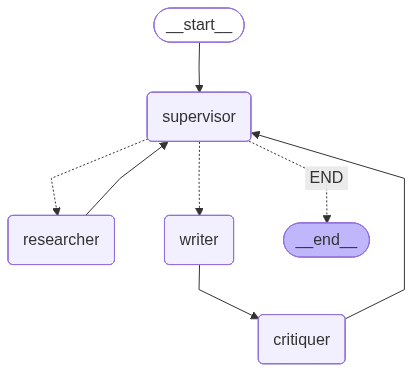

# AI Finance Analyst — Multi-Agent Research Assistant

A collaborative **Agent-to-Agent (A2A)** system built using **LangChain** and **LangGraph**, designed to generate detailed and well-structured financial research reports through intelligent agent cooperation.


*System architecture built with LangGraph illustrating multi-agent collaboration.*

---

## Project Structure

```
Brokerage_App/
├── assets/
│   └── research_graph.png
├── agents.py
├── api.py
├── app.py
├── data_collector.py
├── docker-compose.yml
├── graph.py
├── main.py
├── prompts.py
├── pyproject.toml
├── requirements.txt
├── tests/
├── uv.lock
├── visualize_graph.py
└── README.md
```

---

## Installation

### Prerequisites

- Python 3.9+
- pip or [uv](https://github.com/astral-sh/uv) package manager
- Docker (optional, for PostgreSQL via docker-compose)

### 1. Clone the repository

```bash
git clone https://github.com/Waqas495/Brokerage_App.git
cd Brokerage_App
```

### 2. Install dependencies

```bash
pip install -r requirements.txt
```

### 3. Configure environment variables

Copy the example and fill in your keys:

```bash
cp .env.example .env
```

`.env.example`:
```env
POSTGRES_USER=admin
POSTGRES_PASSWORD=password
POSTGRES_DB=report_gen

ANTHROPIC_API_KEY=your_anthropic_api_key
GROQ_API_KEY=your_groq_api_key
GEMINI_API_KEY=your_gemini_api_key
TAVILY_API_KEY=your_tavily_api_key
FRED_API_KEY=your_fred_api_key

# NVIDIA NIM (optional)
NVIDIA_API_KEY=your_nvidia_api_key
NVIDIA_MODEL=nvidia/nemotron-3-super-120b-a12b

# Ollama (local — no key needed)
OLLAMA_BASE_URL=http://localhost:11434
OLLAMA_MODEL=qwen3.5:4b

LLM_PROVIDER=nvidia
```

**Getting API Keys:**
- **Anthropic**: [console.anthropic.com](https://console.anthropic.com/)
- **Groq**: [console.groq.com](https://console.groq.com/)
- **Gemini**: [aistudio.google.com](https://aistudio.google.com/)
- **Tavily**: [tavily.com](https://tavily.com/)
- **FRED**: [fred.stlouisfed.org/docs/api](https://fred.stlouisfed.org/docs/api/api_key.html)

### 4. Start PostgreSQL (optional)

```bash
docker-compose up -d
```

---

## Usage

### Run the Streamlit App

```bash
streamlit run app.py
```

Opens at `http://localhost:8501`

### Visualize the Agent Graph (optional)

```bash
python visualize_graph.py
```

Saves diagram to `assets/research_graph.png`.

---

## How It Works

Four specialized AI agents collaborate to produce research reports:

| Agent | Role |
|---|---|
| **Supervisor** | Coordinates workflow, delegates tasks |
| **Researcher** | Searches the web via Tavily, gathers findings |
| **Writer** | Drafts and revises reports |
| **Critiquer** | Reviews quality, approves final output |

### Workflow

```
Start → Supervisor → Researcher → Supervisor → Writer → Critiquer → Supervisor
              ↑                                                          ↓
              └──────────────── (loop until approved) ──────────────────┘
```

---

## Troubleshooting

**Import errors** — reinstall dependencies:
```bash
pip install -r requirements.txt --upgrade
```

**API key errors** — verify `.env` is in the project root with no extra spaces.

**Database connection issues** — ensure Docker is running: `docker-compose up -d`

---

## Author

**Waqas** — [LinkedIn](https://www.linkedin.com/in/Waqas495)
